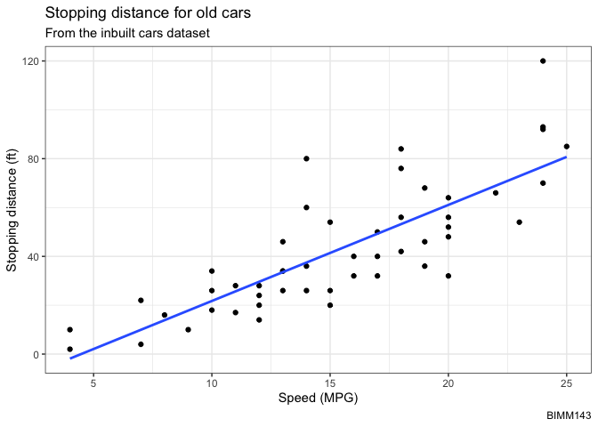
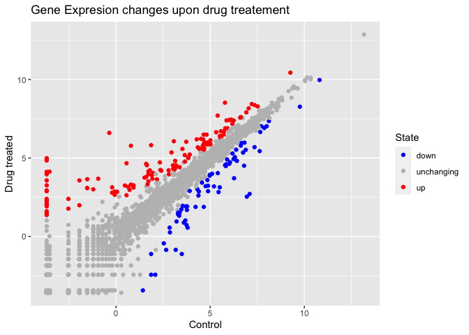
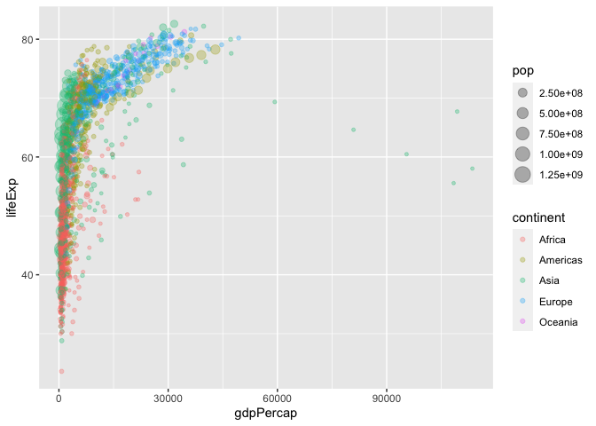
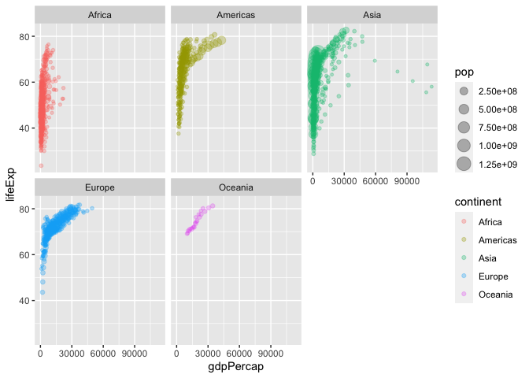

Class 5: Data visualization
================
Barry (PID: 911)

## Base R graphics vs ggplot2

There are many graphics systems available in R, including so-called
“base” R graphics and the very popular **ggplot2** package.

To compare these let’s play with the inbuilt `cars` dataset.

``` r
head(cars)
```

      speed dist
    1     4    2
    2     4   10
    3     7    4
    4     7   22
    5     8   16
    6     9   10

To use “base” R I can simply call the `plot()` function:

``` r
plot(cars)
```


To use `ggplot2` package I first need to install it with the function
`install.packages("ggplot2")`.

I will run this in my R console (i.e. the R brain) as I do not want to
re-install it every time I render my report…

The main function in this package is called `ggplot()`. Can I just call
it

``` r
library(ggplot2)
ggplot()
```


To make a figure with ggplot I need always at least 3 things:

- **data** (i.e. what I want to plot)
- **aes** the aesthetic mapping of the data to the plot I want.
- the **geoms** i.e How I want to plot the data

``` r
ggplot(data=cars) +
  aes(x=speed, y=dist) +
  geom_point()
```


If I want to add more things I can just keep adding layers, e.g.

``` r
ggplot(data=cars) +
  aes(x=speed, y=dist) +
  geom_point() +
  geom_smooth() 
```

    `geom_smooth()` using method = 'loess' and formula = 'y ~ x'


Ggplot is much more verbose than base R plots for standard plots but it
has a consistent layer system that I can use to make just about any
plot.

Let’s make a plot with a straight line fit - i.e. a linear model and no
standard error shown.

``` r
ggplot(data=cars) +
  aes(x=speed, y=dist) +
  geom_point() +
  geom_smooth(se=FALSE, method="lm") +
  labs(title="Stopping distance for old cars",
       subtitle = "From the inbuilt cars dataset",
       caption="BIMM143",
       x= "Speed (MPG)", y="Stopping distance (ft)") +
  theme_bw()
```

    `geom_smooth()` using formula = 'y ~ x'



## A more complicated plot

Let’s lot some gene expression data. The code below reads the results of
a differential expression analysis where a new anti-viral drug is being
tested.

``` r
url <- "https://bioboot.github.io/bimm143_S20/class-material/up_down_expression.txt"
genes <- read.delim(url)
head(genes)
```

            Gene Condition1 Condition2      State
    1      A4GNT -3.6808610 -3.4401355 unchanging
    2       AAAS  4.5479580  4.3864126 unchanging
    3      AASDH  3.7190695  3.4787276 unchanging
    4       AATF  5.0784720  5.0151916 unchanging
    5       AATK  0.4711421  0.5598642 unchanging
    6 AB015752.4 -3.6808610 -3.5921390 unchanging

> Q. How many genes are in this dataset?

``` r
nrow(genes)
```

    [1] 5196

> Q How can we summarize that last column - the “State” column?

``` r
table(genes$State)
```


          down unchanging         up 
            72       4997        127 

``` r
p <- ggplot(genes) +
  aes(x=Condition1, y=Condition2, color=State) +
  geom_point() 
```

I can now just call `p` when I want to plot or add to it.

``` r
p + labs(title="Gene Expresion changes upon drug treatement",
          x="Control", y="Drug treated") +
  scale_colour_manual( values=c("blue","gray","red") )
```



## Going further

Here I read a slightly larger dataset

``` r
# File location online
url <- "https://raw.githubusercontent.com/jennybc/gapminder/master/inst/extdata/gapminder.tsv"

gapminder <- read.delim(url)
head(gapminder)
```

          country continent year lifeExp      pop gdpPercap
    1 Afghanistan      Asia 1952  28.801  8425333  779.4453
    2 Afghanistan      Asia 1957  30.332  9240934  820.8530
    3 Afghanistan      Asia 1962  31.997 10267083  853.1007
    4 Afghanistan      Asia 1967  34.020 11537966  836.1971
    5 Afghanistan      Asia 1972  36.088 13079460  739.9811
    6 Afghanistan      Asia 1977  38.438 14880372  786.1134

``` r
ggplot(gapminder) +
  aes(x=gdpPercap, y=lifeExp, col=continent, size=pop) +
  geom_point(alpha=0.3)
```



A very useful layer to add sometimes is for “faceting”.

``` r
ggplot(gapminder) +
  aes(x=gdpPercap, y=lifeExp, col=continent, size=pop) +
  geom_point(alpha=0.3) +
  facet_wrap(~continent)
```


